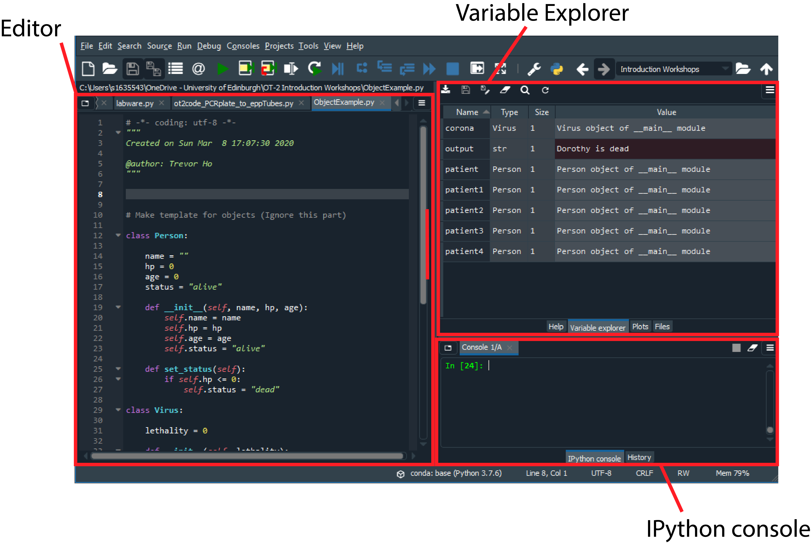

# Introduction
In this workshop we will cover the basic elements of programming in Python. Only materials that are absolutely essential to understanding and programming the OT-2 API will be covered.. This workshop is intended for people with little to no programming experience.

# Objectives

By the end of this workshop, we hope participants are able to:

1. Set up an IDE for coding in Python, and put to use the features that faciliate coding and debugging.
2. Understand the common data types in Python and when to use which.
3. Perform simple calculations and modify strings.
4. Understand the concept of function and where to check their arguments.
5. Write for loops to automatically repeat blocks of codes.
6. Understand superficially the concept of Object-Oriented Programming.
7. Make use of knowledge of points 2-5 above to solve practical issues in using the OT-2.

# Disclaimer
I have limited experience in programming and received little formal training. Coding practices may be unorthodox and even heretic in the eyes of properly trained programmers.

The information that we will go over is filtered specifically for understanding the OT-2 API. Many other useful functions are omitted simply because they are non-essential from the API's perspective. Those who wish to make the full use of Python + the robot would benefit greatly by attending Python courses offered by the Software Capentry in the University of Edinburgh or by the Edinburgh Genomics.

# System Setup

 
## Installing Spyder
It is best to make use of an Integrated Development Environment (IDE) when writing codes. My personal experience suggests that  Spyder is most friendly to Python beginners and its Variable Explorer is tremendously helpful, both in debugging and in understanding how the code works.

The relatively fool-proof way to get Spyder is to download and install [Anaconda](https://www.anaconda.com/distribution/).

*Note: I strongly recommend you NOT to install the app Kite. It does more harm than good in my experience*

From time to time you might need to upgrade your IDE or your packages. To do so, type `conda update --all` inside the Spyder IPython console, or follow the [instructions](https://www.anaconda.com/keeping-anaconda-date/) from Anaconda.

# Navigating within Spyder



## Useful shortcuts in Spyder
1. F5 = Run entire script
2. Ctrl/Cmd + Return/Enter = Run cell
3. Ctrl/Cmd + 1 = Comment/De-comment

**Cells are partitioned by the comment `#%%` in the Spyder Editor.**

# Getting started

## `print()`

The `print()` function is your best friend. You get to know what's going on by asking the computer to show you what you are interested.


```python
print("Hello World")
```

    Hello World
    

## Variable assignment
The equal sign `=` in almost all programming languages denote an assignment of value to a variable.


```python
a = 1000
print(a)
```

    1000
    


```python
b = "OT-2"
print(b)
```

    OT-2
    

Double assignment allows two assignments in a single line.  
You can also do triple or mulitple assignments.


```python
a, b = 1000, "OT-2"
print(a)
print(b)
```

    1000
    OT-2
    

Note that if you don't do an assignment in the line, the console will give the output directly.


```python
a
```


    1000


```python
b
```


    'OT-2'


## Comments
Comments are your explanations of what the code does. It helps other people to understand what you are trying to do, and helps you remember why you code in a particular way. The following example is just an illustration. Comments for self-explanatory codes are redundant.


```python
# This code calculate Fluorescence / OD
fluo = 5000
od = 2.0
fluo_OD = fluo / od
print(fluo_OD)
```

    2500.0
    


```python
# # !"£$%^&*()_+"     * Note that once you have a hashtag, whatever that comes afterwards are all comments.
# You have to start a new line without a hashtag to resume coding
fluo
```


    5000


One useful thing to do with comments is to "comment-out" a section of the code, that is, not run that part only.


```python
a = 1000
b = 200
a = a/b
print("Without using comment-out:")
print(a)
```

    Without using comment-out:
    5.0
    


```python
a = 1000
b = 200
# a = a/b
print("Using comment-out:")
print(a)
```

    Using comment-out:
    1000
    

# Commonly used variable types (officially: data types)

## Some basic data types <a name="ch2.1"></a>
### integer (int)


```python
var_int = 4000
print(var_int)
print(type(var_int))
```

    4000
    <class 'int'>
    

### strings (str)
for texts and characters


```python
var_str = "OT-2"
print(var_str)
print(type(var_str))
```

    OT-2
    <class 'str'>
    

### floating point numbers (float)
In an over-simplified sense, any other number that carries decimal points


```python
var_float = 10123598.8562545
print(var_float)
print(type(var_float))
```

    10123598.8562545
    <class 'float'>
    

### booleans (bool)
Only takes True or False, equivalent to 1 or 0.    


```python
var_bool1 = True
var_bool2 = False
print(var_bool1)
print(var_bool2)
print(type(var_bool1))
```

    True
    False
    <class 'bool'>
    

It is also possible to infer the type of the variable in the console by calling it directly


```python
var_int
```


    4000


```python
var_str
```


    'OT-2'


```python
var_float
```


    10123598.8562545


```python
var_bool1
```


    True


## Type conversion
In some cases it is useful to convert string into numbers, and vice versa


```python
str(89006542)
```


    '89006542'


```python
int('85678')
```


    85678


If you string contains alphabets, conversion to an int or float will fail


```python
int('A1')
```


    ---------------------------------------------------------------------------

    ValueError                                Traceback (most recent call last)

    <ipython-input-21-d5e71966c3c3> in <module>
    ----> 1 int('A1')
    

    ValueError: invalid literal for int() with base 10: 'A1'


Conversion of a float in string format to int is also prohibited


```python
float('85.67')
```


    85.67


```python
int('85.67')
```


    ---------------------------------------------------------------------------

    ValueError                                Traceback (most recent call last)

    <ipython-input-23-515ef414cde9> in <module>
    ----> 1 int('85.67')
    

    ValueError: invalid literal for int() with base 10: '85.67'


Conversion of float to int will remove the digits behind the decimal point 


```python
int(1000.786)
```


    1000


# Lists and dictionaries

If you do a PCR and only have one sample you use a single PCR tube. If you deal with 7-8 samples that are ordered you use PCR tube strips. If you have hundreds of samples you use 96-well or 384-well plates. The key point is that your sample locations are **indexed**. You do the same in programming.

## list
A list is equivalent to PCR tube strips, just that they have (nearly) infinite length. You label one strip with one name.  

Items are delimited by a comma.


```python
var_list = [1, 2, 3, 4, 5, 6]
var_list
```


    [1, 2, 3, 4, 5, 6]


To create an empty list, just leave it empty but with brackets


```python
var_list = []
var_list
```


    []


You can literally put anything inside a list


```python
a = 10
var_list = [1, a, 100, 'text', True] # A mix of int, var, str, and bool
var_list
```


    [1, 10, 100, 'text', True]


You can put a list inside a list


```python
list1 = [5, 6, 7]
list2 = [1, 2 , 3, list1]
list2
```


    [1, 2, 3, [5, 6, 7]]


If you have a long list, you can arrange them vertically in the code.  
Ending a list with a comma is fine.


```python
int_list = [
    1005719631856,
    5746381643542,
    8434216572496,
    2491294949454,
    21975214621121,
    1964943136274,
    1984249121000,
    149219542792464,
]
int_list
```


    [1005719631856,
     5746381643542,
     8434216572496,
     2491294949454,
     21975214621121,
     1964943136274,
     1984249121000,
     149219542792464]


All items inside a list has an index for retrieving the item. A list is ordered - the item order is preserved when the list is called.
Using the example of `var_list`:  

| index | item |
|-----|----|
|0|1|
|1|10|
|2|100|
|3|'text'|
|4|True|

This allows you to get retrieve specific items from the list using the `[]` notation.  

**Note that the first item of a list has the index of 0, not 1. Think of a list as a building and index 0 is the "Ground Floor".**


```python
var_list[0]
```


    1


```python
var_list[3]
```


    'text'


To replace an item in the list, reassign it.  
Let's replace the 'text' item with index=3 to '1000'


```python
var_list[3] = 1000
var_list
```


    [1, 10, 100, 1000, True]


Trying to call the an item beyond indicies that correspond to an item will lead to an `IndexError`.
If you see this error, you must be counting the list wrong.


```python
var_list[5]
```


    ---------------------------------------------------------------------------

    IndexError                                Traceback (most recent call last)

    <ipython-input-33-12cebd302046> in <module>
    ----> 1 var_list[5]
    

    IndexError: list index out of range


Counting backwards? 2nd item from the end of the list? Put a minus symbol `-` before your index `1`


```python
var_list[-2]
```


    1000


Slice a list by using the "slice operator" `:`


```python
# Get items from index = 2 till the end of sequence
var_list[2:]
```


    [100, 1000, True]


```python
# Get items from the beginning till item of index = 2
# In other words, var_list[:3] is equivalent to var_list[0:3]
var_list[:3]
```


    [1, 10, 100]


```python
var_list[3:5]
```


    [1000, True]


**Take note! `[3:5]` actually gives items from index=0 to index=2. So it is actually getting item_of_start_index to item_of_(end_index - 1) !**

Combining a negative index with the splice operator allows you to get multiple items from the end of the list


```python
var_list[-3:]
```


    [100, 1000, True]


***Beware that when couting backwards, the last item has an index of -1, not -0.**

To get the length of the list, use the `len()` function, with the list as the input argument


```python
len(var_list)
```


    5


To add items to a list (aka. grow a list), use the `list.append()` function


```python
item_to_add = 'new'
var_list.append(item_to_add)
var_list
```


    [1, 10, 100, 1000, True, 'new']


```python
# The list should now have a length of 6 instead of 5
len(var_list)
```


    6


To concatenate two or more lists, simply use the `+` operator 


```python
list1 = [1, 2, 3] 
list2 = [4, 5, 6]
list3 = [7, 8, 9]
long_list = list1 + list2 + list3
long_list
```


    [1, 2, 3, 4, 5, 6, 7, 8, 9]


## dictionary (dict)
A dictionary can be understood as a list with unique "name tags" to every item it stores.
While a list is denoted by square brackets, a dictionary is denoted by curly brackets.


```python
chores = {'Monday': "Clean gel tank",
            'Tuesday': "Autoclave tips",
            'Wednesday': "Clear bins"
           }
chores
```


    {'Monday': 'Clean gel tank',
     'Tuesday': 'Autoclave tips',
     'Wednesday': 'Clear bins'}


Items are retreived in a similar way as lists, just that there are no indicies but only "name-tags", which are called **keys**.


```python
chores['Monday']
```


    'Clean gel tank'


If you try to call a key that is absent from the dictionary, you will get an error


```python
chores['Sunday']
```


    ---------------------------------------------------------------------------

    KeyError                                  Traceback (most recent call last)

    <ipython-input-45-50c1074f10b3> in <module>
    ----> 1 chores['Sunday']
    

    KeyError: 'Sunday'


To avoid running into error, use the `dict.get(key)` function


```python
print(chores.get('Monday'))
```

    Clean gel tank
    


```python
print(chores.get('Sunday'))
```

    None
    

Now, the reason why it is called a dictionary, is that like a dictionary, you can't have two entries of the same word.  
If you insist on doing so, the most recent assignment will overwrite the previously assigned key.


```python
# Note how the first definition becomes "erased" in the output

var_dict = {
    'table': "a piece of furniture with a flat top and one or more legs (Google def 1)",
    'table': "a set of facts or figures systematically displayed, especially in columns (Google def 2)"
}
var_dict
```


    {'table': 'a set of facts or figures systematically displayed, especially in columns (Google def 2)'}


To create an empty dictionary, put nothing inside the curly brakets


```python
null_dict = {}
null_dict
```


    {}


To add a `key: item` pair to a dictionary, just assign it to a new key


```python
chores['Thursday'] = "Refill MilliQ water tank"
chores
```


    {'Monday': 'Clean gel tank',
     'Tuesday': 'Autoclave tips',
     'Wednesday': 'Clear bins',
     'Thursday': 'Refill MilliQ water tank'}


Be careful though, if a key alreayd exist, trying to add a new `key: item` pair with the same key will overwrite the previous item.

To concatenate two dictionaries, use the `dict.update()` function. The input argument must be a dictionary.


```python
new_chores = {
    'Friday': "Buy beer for happy hour",
    'Saturday': "Hang over",
             }
chores.update(new_chores)
chores
```


    {'Monday': 'Clean gel tank',
     'Tuesday': 'Autoclave tips',
     'Wednesday': 'Clear bins',
     'Thursday': 'Refill MilliQ water tank',
     'Friday': 'Buy beer for happy hour',
     'Saturday': 'Hang over'}


The same function can also be used to add a single key:item pair, making it a very versatile function. I prefer using it over the assignment method.


```python
chores.update({'Sunday': "Do nothing"})
chores
```


    {'Monday': 'Clean gel tank',
     'Tuesday': 'Autoclave tips',
     'Wednesday': 'Clear bins',
     'Thursday': 'Refill MilliQ water tank',
     'Friday': 'Buy beer for happy hour',
     'Saturday': 'Hang over',
     'Sunday': 'Do nothing'}


# Notes on doing basic maths
Simple addition, subtraction, multiplication is just like that of Excel


```python
5 + 10 * 20
```


    205


The above example takes only int as input and you get back an int as output. Put a float anywhere inside and you get back a float.


```python
5.0 + 10 * 20
```


    205.0


Whenever you do a division, you always get back a float, even if your inputs are all int and your dividend is divisible by your divisor:


```python
100 / 10
```


    10.0


The proper way to do power is not through the `^` sign, but rather, `**`


```python
2^4
```


    6


```python
2 ** 4
```


    16


# Basic string manipulation

String can be seen as list objects consisting of only characters, numbers and symbols. So, you can use some of the same functions from list on strings.

## Empty string


```python
null_str = ""
```

## Concatenation


```python
hello_world  = "Hello" + " " + "World"
hello_world
```


    'Hello World'


## Substring using slice


```python
hello_world[:5]
```


    'Hello'


```python
hello_world[-3:-1]
```


    'rl'


## ~~`.append()`~~
Note that there is no such function `.append()` for str


```python
hello_world.append(" Goodbye World")
```


    ---------------------------------------------------------------------------

    AttributeError                            Traceback (most recent call last)

    <ipython-input-62-b9e99d8024a8> in <module>
    ----> 1 hello_world.append(" Goodbye World")
    

    AttributeError: 'str' object has no attribute 'append'


## `.split()`
The `.split()` function takes a user-determined delimiter, removes the delimiter from the str, and return the rest of the parts as a list.


```python
hello_world.split(" ")
```


    ['Hello', 'World']


```python
"University of Edinburgh".split(" ")
```


    ['University', 'of', 'Edinburgh']


The delimiter can be anything, so long as it is inside the str


```python
split_str = "University of Edinburgh".split(" of ")
split_str
```


    ['University', 'Edinburgh']


The individual words/strings/stretches of characters can then be retrieved through the list's indicies


```python
city_name = split_str[1]
city_name
```


    'Edinburgh'


A combinatoin of double assignment and `.split()` works magic in Python.


```python
my_name = "Trevor Ho"
first_name, last_name = my_name.split(" ")
first_name
```


    'Trevor'


```python
last_name
```


    'Ho'


# Simple custom functions

The function in computer science has its roots in mathematical functions like y = f(x), y is output, f is the function name, x is the input. It is very similar in Python.

Example:


```python
def divide(dividend, divisor):
    quotient = dividend / divisor
    return quotient

divide(1000,10)
```


    100.0


function name: the name that is followed by parentheses and right after the reserved word `def`  
input: variables that are inside the parentheses, their proper name is **"arguments"**  
output: the varaible that follows after the reserved word `return`

the output (and hence `return`) is entirely optional if you just want the function to carry out something

**Important: notice that the lines below `def` are right indented. This is to tell Python that those lines belong to the function**


```python
def divide(dividend, divisor):
quotient = dividend / divisor
return quotient
```


      File "<ipython-input-70-892f0500f8b6>", line 2
        quotient = dividend / divisor
               ^
    IndentationError: expected an indented block
    


An extremely important point is that **the order of arguments matters**:


```python
divide(10,1000)
```


    0.01


However, it is ok change the order if your specify what variables are meant for what arguments


```python
divide(divisor=10, dividend=1000)
```


    100.0


**Note: always write and debug your function without `def` and `return` first before encapsulating it with def and return.**

# For loop

For loop is used when you need to repeat blocks of code for a set number of times. 
The for loop is arguably the most important concept to master if you wish to make the most out of the robot.

Let's start with an example


```python
for i in [1,2,3]:
    print("I should do my experiments")
```

    I should do my experiments
    I should do my experiments
    I should do my experiments
    

The command `print()` was executed three times, because there are 3 items within the list of `[1,2,3]`  
Notice that it was indented and so was within the loop.

Simply iterating a fixed action isn't very helpful, but the for loop in Python is inherently built to be mutable at every iteration:


```python
for well in ["A1", "B1", "C1"]:
    action = "Pipette water into well " + well
    print(action)
```

    Pipette water into well A1
    Pipette water into well B1
    Pipette water into well C1
    

## `range()`

If you need to iterate your action 100 times, it would not make sense to manually create a list of 1 to 100.
The `range(start, stop, step)` function is very useful in this situation.


```python
# Notice that the range function creates only a range object
x = range(1,10)
x
```


    range(1, 10)


```python
# To turn that into something useful, pass the range object into the list() function
list(x)
```


    [1, 2, 3, 4, 5, 6, 7, 8, 9]


Notice that the function does not stop at `10`, but rather, `9`. This is similar to the `:` operator in slicing a list. To obtain a list of numbers from 1 to 12, the correct input is `range(1,13)`

A combination of the `range()` function with a for loop then works magic.


```python
for column in range(1,13): # by convention, variable names of i, j, k are very popular in for loop creation
    action = "Pipette water into column " + str(column) + " of the destination plate"
    print(action)
```

    Pipette water into column 1 of the destination plate
    Pipette water into column 2 of the destination plate
    Pipette water into column 3 of the destination plate
    Pipette water into column 4 of the destination plate
    Pipette water into column 5 of the destination plate
    Pipette water into column 6 of the destination plate
    Pipette water into column 7 of the destination plate
    Pipette water into column 8 of the destination plate
    Pipette water into column 9 of the destination plate
    Pipette water into column 10 of the destination plate
    Pipette water into column 11 of the destination plate
    Pipette water into column 12 of the destination plate
    

## Nested for loops

Sometimes we have loop in more than 1 dimension, e.g. Sample 1: pipette up and down 3 times, Sample 2: pipette up and down 3 times, Sample 3: pipette up and down 3 times.

To do this, it is helpful to put one for loop inside the other.


```python
for sample in ["1", "2", "3"]:
    change_sample = "Switch to sample " + sample
    print(change_sample)
    for i in range(3):
        print("Pipette sample up and down")
```

    Switch to sample 1
    Pipette sample up and down
    Pipette sample up and down
    Pipette sample up and down
    Switch to sample 2
    Pipette sample up and down
    Pipette sample up and down
    Pipette sample up and down
    Switch to sample 3
    Pipette sample up and down
    Pipette sample up and down
    Pipette sample up and down
    

To further integrate the sample name and action step:


```python
for sample in ["1", "2", "3"]:
    for i in range(3):
        action = "Pipette sample " + sample + " up and down"
        print(action)
```

    Pipette sample 1 up and down
    Pipette sample 1 up and down
    Pipette sample 1 up and down
    Pipette sample 2 up and down
    Pipette sample 2 up and down
    Pipette sample 2 up and down
    Pipette sample 3 up and down
    Pipette sample 3 up and down
    Pipette sample 3 up and down
    

# If else statements (optional material)

## Comparison operators
They are used to compare two variables. Output is a boolean.


```python
10 < 100
```


    True


```python
10 > 100
```


    False


```python
15 <= 15
```


    True


**Comparison operator for checking equality is `==`. This often get mixed up with the assignment symbol `=`.**


```python
'Python' == 'Python'
```


    True


```python
'Python' != 'Python'
```


    False


Checking if item in lists and dictionaries


```python
list1 = [1, 2, 3, 4, 5, 6, 7, 8]
3 in list1
```


    True


```python
9 in list1
```


    False


```python
chores
```


    {'Monday': 'Clean gel tank',
     'Tuesday': 'Autoclave tips',
     'Wednesday': 'Clear bins',
     'Thursday': 'Refill MilliQ water tank',
     'Friday': 'Buy beer for happy hour',
     'Saturday': 'Hang over',
     'Sunday': 'Do nothing'}


```python
'Monday' in chores
```


    True


```python
'March' in chores
```


    False


## Logical operators


```python
True and True
```


    True


```python
True and False
```


    False


```python
True or False
```


    True


```python
not True
```


    False


```python
8 >= 9 and 10 <= 11
```


    False


```python
8 >= 9 or 10 <= 11
```


    True


```python
8 >= 9 or not (10 <= 11)
```


    False


## If else examples


```python
fluo1 = 16
fluo2 = 20
if fluo1 == fluo2:
    print("Same")
else:
    print("Different")

```

    Different
    


```python
if fluo1 == fluo2:
    print("Same")
elif fluo1 > fluo2:
    print("Fluo1 larger")
else:
    print("Fluo2 larger")    
```

    Fluo2 larger
    

**Indentation is important**


```python
if fluo1 == fluo2:
    print("Same")
    elif fluo1 > fluo2:
        print("Fluo1 larger")
    else:
        print("Fluo2 larger")  
```


      File "<ipython-input-99-9d4b7f21bf49>", line 3
        elif fluo1 > fluo2:
           ^
    SyntaxError: invalid syntax
    


# A superficial introduction to the concept of Object-Oriented Programming (OOP)

The idea of OOP is to make virtual objects inside the computer and let them interact with each other, or ask them to do something.

A good cartoon illustration is available on a [page](https://www.freecodecamp.org/news/object-oriented-programming-concepts-21bb035f7260/) written by FreeCodeCamp. Let's scroll until you see a cat.

The most important concept is that most virtual objects are like an object in real life: each has some properties (e.g. breed, color, gender, height, weight, etc.) and is able do something (e.g. meow, eat, sleep, etc)

Objects' properties are coded by variables within an object. In Python, they are accessed as `object.var`.  
For example, `cat.breed`  

Objects' abilities to do something are executed via functions. In Python, they are accessed as `object.function()`  
For example, `cat.eat()`

Take home messages:
1. If you see `sth.xyz`, without parentheses behind, `xyz` is a variable/attribute/property of the object. 
2. If you see `sth.xyz()`, `xyz()` is a function that is part of the "innate" abilities of the object to do something.  
3. Objects themselves can act on other objects, i.e. when an object is an argument of a function of another object.

Superficially, the terms "properties", "attributes" and "fields" are often used interchanagbly, so are the terms "functions", "methods", "behaviors".

The following is an example of creating objects of humans and viruses to see if the humans with some properties (`age`) can survive an infection `.infect()` by a virus:


```python
# Make templates for objects (Ignore this part)

class Person:
    
    name = ""
    hp = 0
    age = 0
    status = "alive"
    
    def __init__(self, name, hp, age):
        self.name = name
        self.hp = hp
        self.age = age
        self.status = "alive"
        
    def set_status(self):
        if self.hp <= 0:
            self.status = "dead"
        
class Virus:
    
    lethality = 0
    
    def __init__(self, lethality):
        self.lethality = lethality
        
    def infect(self,person):
        person.hp = person.hp - person.age * self.lethality
        person.set_status()

# Create objects

patient1 = Person(name = "Alexander", hp = 1000, age = 50)
patient2 = Person(name = "Beth", hp = 9000, age = 25)
patient3 = Person(name = "Chris", hp = 5000, age = 17)
patient4 = Person(name = "Dorothy", hp = 7000, age = 90)

corona = Virus(lethality = 100)

# Let objects take action

corona.infect(patient1)
corona.infect(patient2)
corona.infect(patient3)
corona.infect(patient4)

# Get the outcomes

for patient in [patient1, patient2, patient3, patient4]:
    outcome = patient.name + " is " + patient.status
    print(outcome)
```

    Alexander is dead
    Beth is alive
    Chris is alive
    Dorothy is dead
    

#Final remarks (that we cannot cover today)

1. When you are stuck, Google. Chances are there is someone who had the same issue as you do and his/her question is answered on Stack Overflow.

2. There is an [official guide](https://www.python.org/dev/peps/pep-0008) in Python on how to style your code to improve readibility. As you code more and more frequently you will find this useful.

3. Learning how to read documentation of libraries / codes written by others will grant you the ability to learn how to code on your own.

4. Properly document your code will make them useful to yourself and others in the long run.
